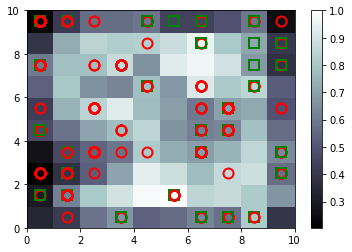

# CreditCardApplication

This is part of the online course available on the Udemy. https://www.udemy.com/course/deeplearning/

Here, I created a hybrid deep learing model using Self-organizing maps which was used to create low-dimensional representation of the high dimensional data. Using, this we got the result as below:

Here, the red circle represent that customer didn't get the approval and green square represent that customer did get approval. The most noticable outliers are the white squares which signify higher risk customers. We can depict that white squares have both red circle and green square and we can say that some customers got approval and some customers didn't got approval. SOM being un-supervised machine learning model, we didn't provide target variable while training.

We trained the ANN model using Tensorflow and we achieved the training accuracy of around 93%.
